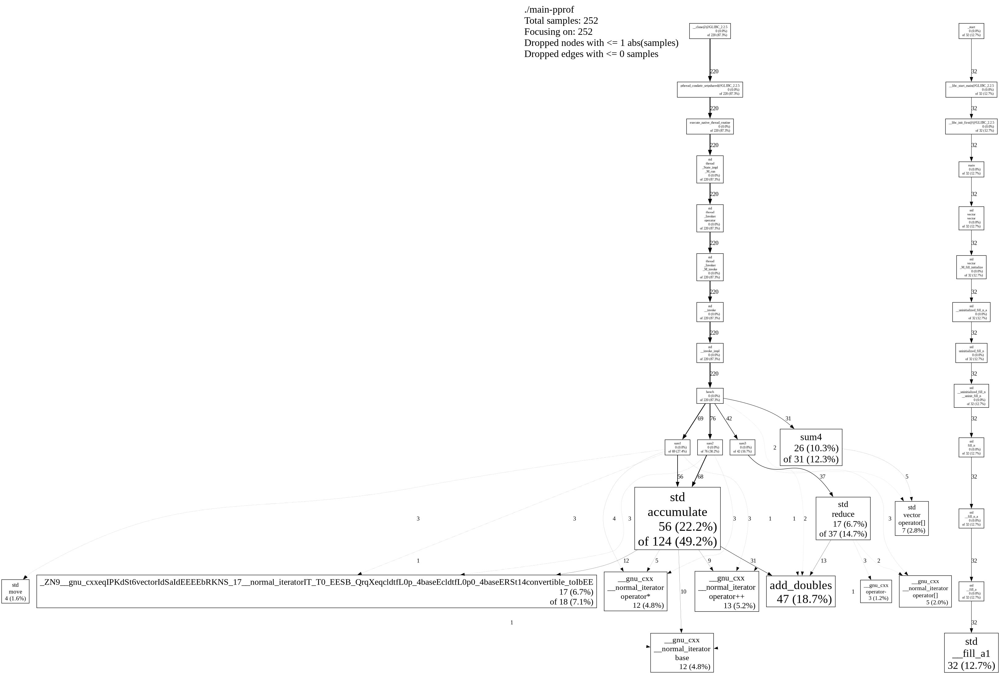
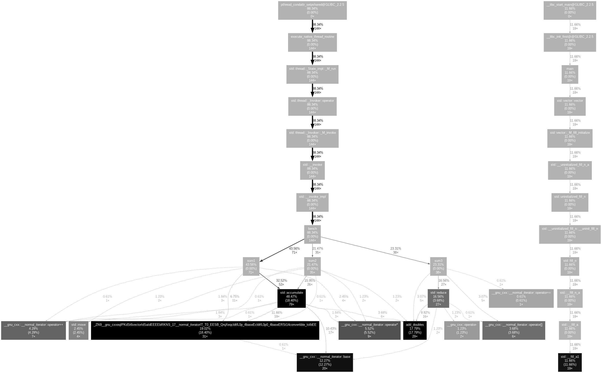
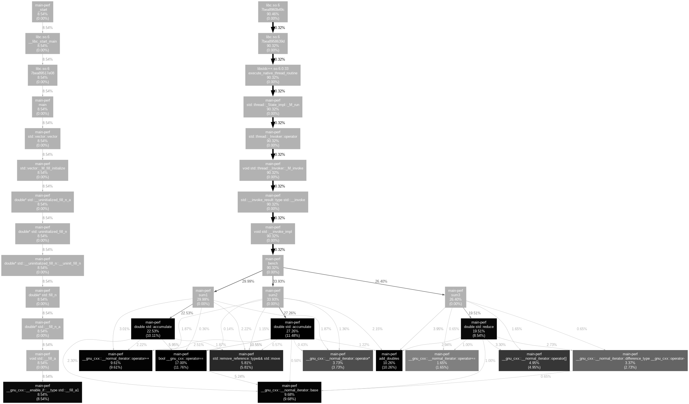

# [pprof (gpertools)](https://github.com/gperftools/gperftools)

gperftools is a collection of a high-performance multi-threaded malloc() implementation, plus some pretty nifty performance analysis tools.

| pprof --dot | pprof --callgrind \| gprof2dot |
| --- | --- |
|  |  |

# [gprof](https://sourceware.org/binutils/docs/gprof/index.html)

gprof is the GNU profiler and you can use it to determine which parts of a program are taking most of the execution time.

❌ No support for muti-threaded applications.

# [perf](https://perfwiki.github.io/main)

Linux profiling with performance counters

`perf` can instrument CPU performance counters, tracepoints, kprobes, and uprobes (dynamic tracing). It is capable of lightweight profiling.

