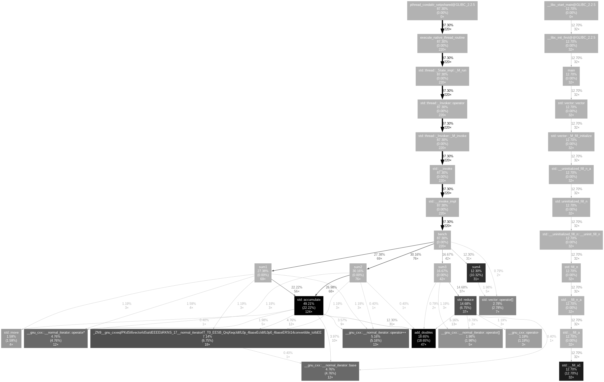
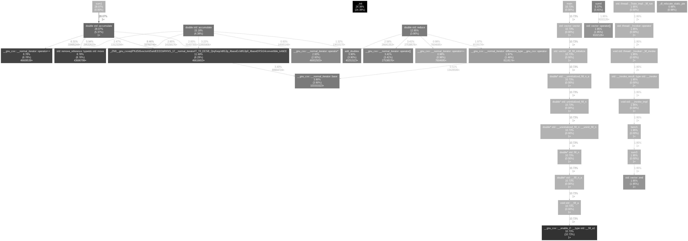
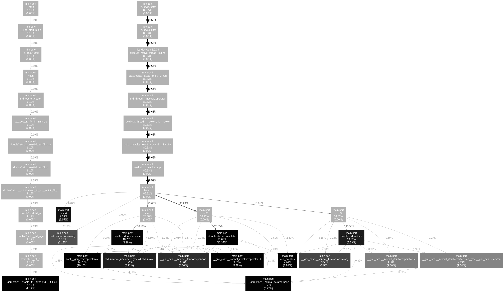

# [pprof](https://github.com/google/pprof)

pprof is a tool for visualization and analysis of profiling data.

pprof reads a collection of profiling samples and generates reports to visualize and help analyze the data. It can generate both text and graphical reports (through the use of the dot visualization package).

| pprof --dot | pprof --callgrind \| gprof2dot |
| --- | --- |
|  |  |

# [gprof](https://sourceware.org/binutils/docs/gprof/index.html)

gprof is the GNU profiler and you can use it to determine which parts of a program are taking most of the execution time.

❌ No support for muti-threaded applications.

# [perf](https://perfwiki.github.io/main)

Linux profiling with performance counters

`perf` can instrument CPU performance counters, tracepoints, kprobes, and uprobes (dynamic tracing). It is capable of lightweight profiling.

